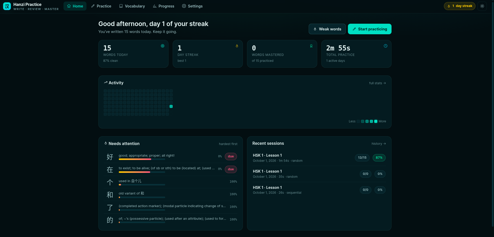
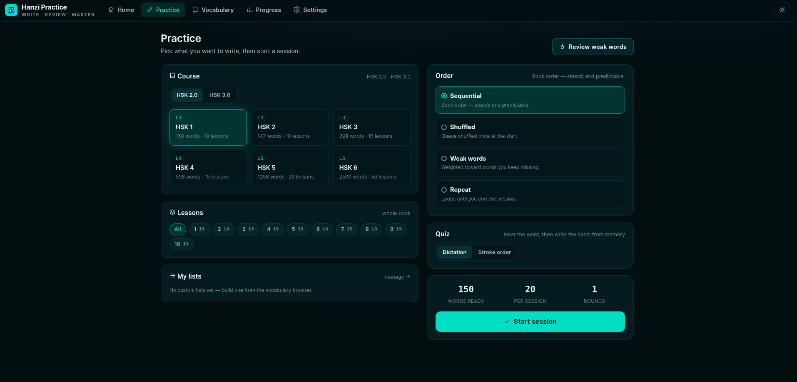
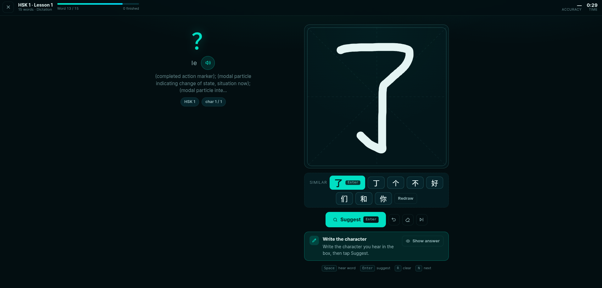

# Hanzi Practice

**Write · Review · Master** — a browser app for learning to write Chinese characters
by hand. Hear a word, write it from memory, and get real feedback on every stroke.

- **Write from memory** — dictation mode plays the word, you write the hanzi
- **AI reads your handwriting** — recognizes what you drew and suggests the characters it looks like
- **Real stroke feedback** — stroke-by-stroke checking with hints when you're stuck
- **HSK 1–6 courses** — nearly 5,000 words across lessons, plus your own custom lists
- **Tracks your progress** — streaks, weak words, accuracy, session history
- **Private by design** — everything stays in your browser; no accounts, no uploads



*Home — today's stats, activity heatmap, words that need attention and recent sessions.*



*Practice — pick a course and lesson, session order and quiz type, then start.*



*Dictation — hear the word, write it from memory, then choose from the recognized suggestions.*

## What it does

### Write what you hear

The default practice mode: the app shows the pinyin and meaning, speaks the word
aloud, and hides the character. You write it in the big practice box from memory —
then tap **Suggest** and pick the character you meant from the recognized
candidates. Every word is graded, so a "clean" write counts toward your streak.

### It recognizes your handwriting

As soon as you draw, the app runs a handwriting-recognition model **inside your
browser** and shows the characters your drawing most resembles — no server
involved, and nothing about your writing is sent anywhere. Don't like the
candidates? Redraw, or press **Show answer** when you want to give up
gracefully.

### Stroke-order practice with hints

Switch any session to the **Stroke order** quiz: see the character, write it
stroke by stroke, and get per-stroke feedback. Stuck? Choose your hint style —
next stroke, fading ghost, or a full animated guide — and pick how strict the
checking should be, from beginner-friendly to *shape, position and order all
matter*.

### Your course, your way

- **HSK courses** — books HSK 1 through HSK 6 (HSK 2.0 and 3.0 editions),
  split into bite-sized lessons
- **Custom lists** — build your own word lists from the vocabulary browser
- **Session order** — sequential, shuffled, weighted toward your weak words, or
  repeat until you quit
- **Session size** — as few or as many words as you like, with a live preview

### Progress that keeps you going

- **Daily streaks** and a greeting that counts your words as you write
- **Activity heatmap** of your practice days
- **"Needs attention"** — your hardest words, hardest first, with due badges
- **Full progress page** — accuracy trends, writing score, trickiest words and
  session history
- **One-click fresh start** — *Progress → Clear history* wipes your stats and
  sessions so you can start over from the beginning (custom lists and settings
  are kept)

### Vocabulary browser

Look up any word: hanzi, pinyin and meaning for the whole HSK set, with quick
add-to-list so you can drill exactly what you're studying.

### Dark, focused, keyboard-friendly

A calm dark interface with a distraction-free session view. Everything is
reachable by keyboard:

| Key | Action |
| --- | --- |
| `Space` | Hear the word again |
| `Enter` | Suggest / confirm |
| `R` | Clear the canvas |
| `N` | Next word |

## Run it locally

```bash
npm install
npm run dev
```

Then open the printed localhost URL. `npm run build` produces a production
bundle served by `npm run preview`.

## Data & privacy

All progress lives in your browser (localStorage + IndexedDB) and never leaves
your device. You can wipe it any time from **Progress → Clear history** or
**Settings → Reset progress**, keeping your preferences and custom lists.

## Credits & data sources

- Vocabulary: [complete-hsk-vocabulary](https://github.com/drkameleon/complete-hsk-vocabulary) (MIT)
- Stroke paths: [hanzi-writer-data](https://github.com/chanind/hanzi-writer-data) (MIT)
- Handwriting model: [Ismantic/Handwritten](https://huggingface.co/Ismantic/Handwritten) (Apache-2.0)
